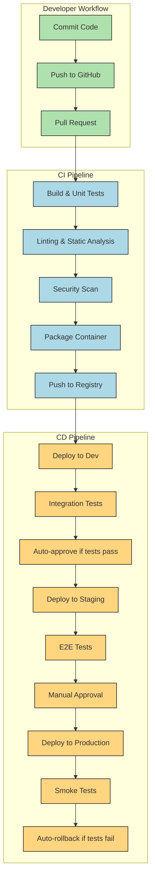

# Infrastructure and DevOps Guide - Insurance Claim Processing System

This document provides detailed guidance for setting up and maintaining the infrastructure and CI/CD pipelines for the Insurance Claim Processing System.

## Infrastructure Architecture

```mermaid
graph TD
    subgraph Production["Production Environment"]
        PK[Kubernetes Cluster]
        
        subgraph PNetworking["Networking"]
            PLB[Load Balancer]
            PING[Ingress Controller]
            PVPN[VPN]
        end
        
        subgraph PCompute["Compute"]
            PFE[Frontend Services]
            PBE[Backend Services]
            PMQ[Message Queue]
        end
        
        subgraph PStorage["Storage"]
            PDB[PostgreSQL]
            PES[MongoDB]
            PS3[MinIO]
            PCCH[Redis]
        end
        
        subgraph PMonitoring["Monitoring"]
            PP[Prometheus]
            PG[Grafana]
            PEL[ELK Stack]
            PAL[Alertmanager]
        end
    end
    
    subgraph Staging["Staging Environment"]
        SK[Kubernetes Cluster]
        
        subgraph SNetworking["Networking"]
            SLB[Load Balancer]
            SING[Ingress Controller]
        end
        
        subgraph SCompute["Compute"]
            SFE[Frontend Services]
            SBE[Backend Services]
            SMQ[Message Queue]
        end
        
        subgraph SStorage["Storage"]
            SDB[PostgreSQL]
            SES[MongoDB]
            SS3[MinIO]
            SCCH[Redis]
        end
        
        subgraph SMonitoring["Monitoring"]
            SP[Prometheus]
            SG[Grafana]
            SEL[ELK Stack]
        end
    end
    
    subgraph Dev["Development Environment"]
        DK[Kubernetes Cluster]
        
        subgraph DCompute["Compute"]
            DFE[Frontend Services]
            DBE[Backend Services]
            DMQ[Message Queue]
        end
        
        subgraph DStorage["Storage"]
            DDB[PostgreSQL]
            DES[MongoDB]
            DS3[MinIO]
            DCCH[Redis]
        end
    end
    
    subgraph CI["CI/CD Infrastructure"]
        GHA[GitHub Actions]
        REG[Container Registry]
        ART[Artifact Repository]
        VS[Vault Server]
    end
    
    PLB --> PING
    PING --> PFE
    PING --> PBE
    PBE --> PDB
    PBE --> PES
    PBE --> PS3
    PBE --> PCCH
    PBE --> PMQ
    
    REG --> PFE
    REG --> PBE
    ART --> PBE
    
    PBE --> PP
    PFE --> PP
    PP --> PG
    PP --> PAL
    PBE --> PEL
    PFE --> PEL
    
    SLB --> SING
    SING --> SFE
    SING --> SBE
    SBE --> SDB
    SBE --> SES
    SBE --> SS3
    SBE --> SCCH
    SBE --> SMQ
    
    REG --> SFE
    REG --> SBE
    ART --> SBE
    
    SBE --> SP
    SFE --> SP
    SP --> SG
    SBE --> SEL
    SFE --> SEL
    
    DBE --> DDB
    DBE --> DES
    DBE --> DS3
    DBE --> DCCH
    DBE --> DMQ
    
    REG --> DFE
    REG --> DBE
    ART --> DBE
    
    GHA --> REG
    GHA --> ART
    GHA --> VS
    
    classDef k8s fill:#326CE5,color:white,stroke:#fff,stroke-width:1px
    classDef network fill:#FF9900,stroke:#fff,stroke-width:1px
    classDef compute fill:#34A853,color:white,stroke:#fff,stroke-width:1px
    classDef storage fill:#800080,color:white,stroke:#fff,stroke-width:1px
    classDef monitoring fill:#1976D2,color:white,stroke:#fff,stroke-width:1px
    classDef cicd fill:#FE6F5E,stroke:#fff,stroke-width:1px
    
    class PK,SK,DK k8s
    class PLB,PING,PVPN,SLB,SING network
    class PFE,PBE,PMQ,SFE,SBE,SMQ,DFE,DBE,DMQ compute
    class PDB,PES,PS3,PCCH,SDB,SES,SS3,SCCH,DDB,DES,DS3,DCCH storage
    class PP,PG,PEL,PAL,SP,SG,SEL monitoring
    class GHA,REG,ART,VS cicd
```



## Infrastructure as Code

All infrastructure is managed as code using Terraform and Kubernetes manifests.

### Directory Structure
```
/infrastructure/
├── terraform/
│   ├── modules/
│   │   ├── networking/
│   │   ├── databases/
│   │   ├── kubernetes/
│   │   └── monitoring/
│   ├── environments/
│   │   ├── dev/
│   │   ├── staging/
│   │   └── production/
│   └── global/
├── kubernetes/
│   ├── base/
│   │   ├── claim-service/
│   │   ├── payment-service/
│   │   ├── document-service/
│   │   ├── notification-service/
│   │   └── ...
│   └── overlays/
│       ├── dev/
│       ├── staging/
│       └── production/
└── ci/
    ├── github-actions/
    └── scripts/
```

### Terraform Modules

We use the following Terraform modules:

1. **Networking**: VPC, subnets, security groups, load balancers
2. **Databases**: PostgreSQL, MongoDB, Redis
3. **Kubernetes**: EKS or AKS cluster configuration
4. **Monitoring**: Prometheus, Grafana, ELK Stack

### Kubernetes Resources

All applications are deployed as Kubernetes resources:

- **Deployments**: For stateless services
- **StatefulSets**: For stateful services like databases
- **Services**: For internal service discovery
- **Ingress**: For external access
- **ConfigMaps/Secrets**: For configuration
- **HorizontalPodAutoscalers**: For scaling based on metrics

## CI/CD Pipeline



### GitHub Actions Workflows

We use GitHub Actions for CI/CD with the following main workflows:

1. **build.yml**: Builds and tests the code on every PR and push to main
2. **deploy-dev.yml**: Deploys to development on every merge to main
3. **deploy-staging.yml**: Deploys to staging after successful dev deployment and tests
4. **deploy-production.yml**: Deploys to production after manual approval

#### Example build.yml:

```yaml
name: Build and Test

on:
  push:
    branches: [ main ]
  pull_request:
    branches: [ main ]

jobs:
  build:
    runs-on: ubuntu-latest
    
    steps:
    - uses: actions/checkout@v3
    
    - name: Set up JDK 21
      uses: actions/setup-java@v3
      with:
        java-version: '21'
        distribution: 'corretto'
        
    - name: Build with Maven
      run: ./mvnw clean verify
      
    - name: Run tests
      run: ./mvnw test
      
    - name: SonarQube scan
      run: ./mvnw sonar:sonar
      
    - name: Build Docker image
      run: docker build -t claim-service:${{ github.sha }} .
      
    - name: Run Trivy vulnerability scanner
      uses: aquasecurity/trivy-action@master
      with:
        image-ref: 'claim-service:${{ github.sha }}'
        format: 'table'
        exit-code: '1'
        severity: 'CRITICAL,HIGH'
        
    - name: Push Docker image
      if: github.event_name == 'push'
      run: |
        echo ${{ secrets.GITHUB_TOKEN }} | docker login ghcr.io -u ${{ github.actor }} --password-stdin
        docker tag claim-service:${{ github.sha }} ghcr.io/${{ github.repository }}/claim-service:${{ github.sha }}
        docker push ghcr.io/${{ github.repository }}/claim-service:${{ github.sha }}
```

## Infrastructure Security

### Network Security

1. **VPC Isolation**: Each environment has its own VPC
2. **Security Groups**: Strict access control between services
3. **Private Subnets**: All databases and internal services in private subnets
4. **VPN Access**: Admin access only through VPN
5. **HTTPS Everywhere**: TLS for all communications, internal and external

### Access Control

1. **IAM**: Least privilege principle for all service accounts
2. **RBAC**: Kubernetes role-based access control
3. **Secrets Management**: HashiCorp Vault for secrets
4. **MFA**: Required for all human access to production
5. **Service Meshes**: mTLS between services in production

### Monitoring and Alerting

1. **Metrics**: Prometheus for time-series metrics
2. **Dashboards**: Grafana for visualization
3. **Logs**: ELK Stack for centralized logging
4. **Alerts**: PagerDuty integration for critical alerts
5. **Audit**: All access and changes are audited

## Environment Configuration

Configuration is managed using a combination of:

1. **ConfigMaps**: For non-sensitive configuration
2. **Secrets**: For sensitive data
3. **Environment Variables**: For runtime configuration
4. **Spring Cloud Config**: For centralized configuration

### Configuration Hierarchy

```
Base Configuration (common to all environments)
  ↓
Environment-specific Configuration (dev/staging/prod)
  ↓
Service-specific Configuration
  ↓
Instance-specific Configuration (rarely used)
```

## Disaster Recovery

### Backup Strategy

1. **Databases**: Daily full backups, hourly incremental backups
2. **Document Storage**: Versioned objects with cross-region replication
3. **Configuration**: Git-based with full history
4. **Images**: Immutable and archived in registry

### Recovery Process

1. **RTO (Recovery Time Objective)**: 1 hour for critical services
2. **RPO (Recovery Point Objective)**: 15 minutes for critical data
3. **Failover**: Automated for infrastructure, semi-automated for applications
4. **Testing**: Monthly disaster recovery exercises

## Local Development

### Docker Compose

For local development, we provide a Docker Compose setup:

```yaml
version: '3.8'

services:
  postgresql:
    image: postgres:14-alpine
    ports:
      - "5432:5432"
    environment:
      POSTGRES_USER: claimuser
      POSTGRES_PASSWORD: dev_password
      POSTGRES_DB: claims
    volumes:
      - postgres-data:/var/lib/postgresql/data

  mongodb:
    image: mongo:5
    ports:
      - "27017:27017"
    environment:
      MONGO_INITDB_ROOT_USERNAME: eventstore
      MONGO_INITDB_ROOT_PASSWORD: dev_password
    volumes:
      - mongo-data:/data/db

  minio:
    image: minio/minio
    ports:
      - "9000:9000"
      - "9001:9001"
    environment:
      MINIO_ROOT_USER: minioadmin
      MINIO_ROOT_PASSWORD: minioadmin
    volumes:
      - minio-data:/data
    command: server /data --console-address ":9001"

  redis:
    image: redis:6-alpine
    ports:
      - "6379:6379"
    volumes:
      - redis-data:/data

  kafka:
    image: confluentinc/cp-kafka:7.0.0
    ports:
      - "9092:9092"
    environment:
      KAFKA_BROKER_ID: 1
      KAFKA_ZOOKEEPER_CONNECT: zookeeper:2181
      KAFKA_ADVERTISED_LISTENERS: PLAINTEXT://kafka:29092,PLAINTEXT_HOST://localhost:9092
      KAFKA_LISTENER_SECURITY_PROTOCOL_MAP: PLAINTEXT:PLAINTEXT,PLAINTEXT_HOST:PLAINTEXT
      KAFKA_INTER_BROKER_LISTENER_NAME: PLAINTEXT
      KAFKA_OFFSETS_TOPIC_REPLICATION_FACTOR: 1
    depends_on:
      - zookeeper

  zookeeper:
    image: confluentinc/cp-zookeeper:7.0.0
    ports:
      - "2181:2181"
    environment:
      ZOOKEEPER_CLIENT_PORT: 2181
      ZOOKEEPER_TICK_TIME: 2000

volumes:
  postgres-data:
  mongo-data:
  minio-data:
  redis-data:
```

### Development Tools

1. **Local Kubernetes**: minikube or Docker Desktop Kubernetes
2. **Skaffold**: For fast local development workflow
3. **Telepresence**: For local development with remote services
4. **DevContainer**: VS Code dev containers for consistent environments

## Monitoring and Observability

### Key Metrics

1. **Business Metrics**:
   - Claims submitted per hour
   - Claims processing time
   - Approval/rejection ratio
   - Payment processing time

2. **Technical Metrics**:
   - Request rate and latency
   - Error rate (4xx, 5xx)
   - CPU/Memory usage
   - Database connection pool stats
   - Queue length and processing rate

### Dashboards

Key dashboards will be created for:

1. **Service Health**: Overall health of services
2. **Business KPIs**: Business metrics tracking
3. **Performance**: Performance metrics
4. **Errors**: Error tracking and analysis
5. **SLOs**: Service Level Objective tracking

### Logging Standards

All logs should include:

1. **Request ID**: For tracing through systems
2. **User/Service ID**: Who initiated the action
3. **Resource ID**: What resource was affected
4. **Action**: What was done
5. **Result**: Success or failure with reason
6. **Timestamp**: When it happened
7. **Metadata**: Relevant contextual information

## Cost Optimization

### Strategies

1. **Right-sizing**: Use appropriate instance sizes
2. **Auto-scaling**: Scale based on demand
3. **Spot Instances**: For non-critical workloads
4. **Reserved Instances**: For predictable workloads
5. **Cost Monitoring**: Regular review of costs
6. **Dev/Test Shutdown**: Automatic shutdown of non-production environments outside business hours

### Estimated Monthly Costs

| Environment | Component | Specification | Monthly Cost |
|-------------|-----------|---------------|--------------|
| Development | Kubernetes | 3 nodes, 4 vCPU, 16GB RAM | $360 |
| Development | Databases | Standard tier | $200 |
| Development | Storage | 100GB SSD | $10 |
| Staging | Kubernetes | 3 nodes, 8 vCPU, 32GB RAM | $720 |
| Staging | Databases | Standard tier | $300 |
| Staging | Storage | 200GB SSD | $20 |
| Production | Kubernetes | 6 nodes, 8 vCPU, 32GB RAM | $1,440 |
| Production | Databases | High-availability tier | $600 |
| Production | Storage | 500GB SSD | $50 |
| Global | CI/CD | Build runners, registry | $200 |
| Global | Monitoring | Logs, metrics | $300 |
| **Total** | | | **$4,200** |

## Compliance and Security Requirements

### Data Protection

1. **Data Classification**: All data classified by sensitivity
2. **Encryption**: Data encrypted at rest and in transit
3. **Access Control**: Least privilege access to data
4. **Data Lifecycle**: Clear policies for data retention and deletion
5. **PII Handling**: Special handling for personally identifiable information

### Compliance Checks

1. **Automated Compliance**: Automated checks in CI/CD
2. **Security Scanning**: Regular vulnerability scanning
3. **Penetration Testing**: Quarterly penetration testing
4. **Compliance Audits**: Annual compliance audits
5. **Code Reviews**: Security-focused code reviews

## Conclusion

This infrastructure and DevOps guide provides a comprehensive framework for building, deploying, and operating the Insurance Claim Processing System in a secure, scalable, and cost-effective manner.

The approach prioritizes:
- Infrastructure as code for reproducibility
- Automated CI/CD for reliable deployments
- Comprehensive monitoring for observability
- Security by design
- Cost-effectiveness through optimization

Team members should refer to this document when making infrastructure decisions and setting up development environments.