# Insurance Claim Process Flow

This document visualizes the insurance claim process identified during our event storming session.

## End-to-End Process Diagram

```mermaid
flowchart LR
    %% Define all nodes
    claimSubmission["Claim Submission\nSelf-Service"]
    customer["Customer"]
    submitClaim["Submit claim\n(online or via mail)"]
    claimSubmitted["Claim\nsubmitted"]
    
    checkDocs["Check\ndocumentation\n(completeness)"]
    admin["Administrator\nin charge"]
    claimRegistered["Claim\nregistered"]
    claimAgg1["Claim"]
    
    checkInsurance["Check\ninsurance"]
    respClaimsVerify["Responsible\nperson in\nclaims\ndepartment"]
    assessmentPerformed["Assessment\nperformed"]
    claimAgg2["Claim"]
    
    acceptClaim["Accept claim\nand schedule\npayment"]
    rejectClaim["Reject claim"]
    respClaimsDecision["Responsible\nperson in\nclaims\ndepartment"]
    paymentScheduled["Payment\nscheduled"]
    claimRejected["Claim\nrejected"]
    claimAgg3["Claim"]
    
    performPayment["Perform\npayment"]
    paymentPerformed["Payment\nperformed"]
    paymentAgg["Payment"]
    
    notification["Notification"]
    notifyCustomer["Notify\ncustomer (by\nmail)"]
    customerNotified["Customer\nnotified"]
    
    policyContext["Realization in\nthe Policy\nManagement\nContext?"]
    boundedContext["Or new\nBounded\nContext?"]

    %% Connect nodes
    customer -.- submitClaim
    submitClaim --> claimSubmitted
    claimSubmitted --> checkDocs
    claimSubmission -.- submitClaim
    
    admin -.- checkDocs
    checkDocs --> claimRegistered
    claimRegistered --> checkInsurance
    claimAgg1 -.- checkDocs
    
    respClaimsVerify -.- checkInsurance
    checkInsurance --> assessmentPerformed
    assessmentPerformed --> acceptClaim
    assessmentPerformed --> rejectClaim
    claimAgg2 -.- checkInsurance
    
    respClaimsDecision -.- acceptClaim
    respClaimsDecision -.- rejectClaim
    acceptClaim --> paymentScheduled
    rejectClaim --> claimRejected
    paymentScheduled --> performPayment
    claimAgg3 -.- acceptClaim
    
    performPayment --> paymentPerformed
    paymentPerformed --> notifyCustomer
    claimRejected --> notifyCustomer
    paymentAgg -.- performPayment
    
    notifyCustomer --> customerNotified
    notification -.- notifyCustomer
    
    paymentPerformed -.-> policyContext
    claimRejected -.-> boundedContext

    %% Styling
    classDef aggregate fill:#FFFACD,stroke:#333,stroke-width:1px
    classDef domainEvent fill:#FFA07A,stroke:#333,stroke-width:1px
    classDef command fill:#87CEFA,stroke:#333,stroke-width:1px
    classDef userRole fill:#FFFACD,stroke:#333,stroke-width:1px,shape:circle
    classDef issue fill:#FF69B4,stroke:#333,stroke-width:1px
    classDef section fill:#F0F0F0,stroke:#333,stroke-width:1px,stroke-dasharray: 5 5
    
    class claimSubmission,claimAgg1,claimAgg2,claimAgg3,paymentAgg,notification aggregate
    class claimSubmitted,claimRegistered,assessmentPerformed,paymentScheduled,paymentPerformed,claimRejected,customerNotified domainEvent
    class submitClaim,checkDocs,checkInsurance,acceptClaim,rejectClaim,performPayment,notifyCustomer command
    class customer,admin,respClaimsVerify,respClaimsDecision userRole
    class policyContext,boundedContext issue
```

## Process Steps Explained

### 1. Claim Submission
A customer submits an insurance claim either online through a self-service portal or by mail. This generates the "Claim submitted" domain event.

### 2. Documentation Verification
An administrator checks the claim documentation for completeness, resulting in the "Claim registered" domain event.

### 3. Insurance Verification
A responsible person in the claims department verifies the insurance coverage, leading to the "Assessment performed" domain event.

### 4. Decision Point
Based on the assessment:
- The claim may be accepted, leading to payment scheduling
- The claim may be rejected, leading to the "Claim rejected" domain event

### 5. Payment Processing
For approved claims, the payment is scheduled and then performed, generating the "Payment performed" domain event.

### 6. Notification
Regardless of the outcome (payment or rejection), the customer is notified by mail about the result of their claim.

## Strategic Considerations

During our event storming session, we identified key strategic questions about where this process fits in our domain landscape:
- Should this process be realized within the existing Policy Management Context?
- Or does it deserve its own dedicated Bounded Context?

These architectural decisions will impact how we structure our microservices and domain models.