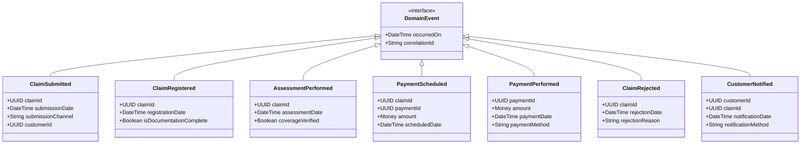
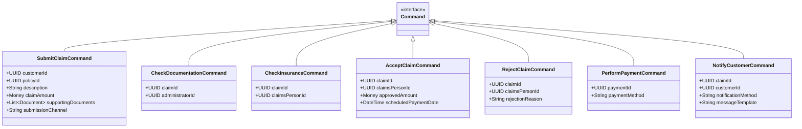

# Insurance Claim Domain Model

This document details the key domain components identified during our event storming session, providing a foundation for implementing the insurance claim processing system.

## Domain Events

Domain events represent significant occurrences within the system that domain experts care about.

## Aggregates

Aggregates are clusters of domain objects that can be treated as a single unit. 

## Commands

Commands represent business operations that can be performed in the system.

## User Roles and Actors

## Value Objects

## Enums

## Strategic Design Considerations

The event storming session raised important questions about the boundaries of our domain model:

1. **Policy Management Context vs Dedicated Bounded Context:**
   - Should the claim processing capabilities be part of the Policy Management context?
   - Or should it be separated into its own Bounded Context?

2. **Integration Points:**
   - If separated, the Claim Processing context would need:
     - Policy information from the Policy Management context
     - Customer information from the Customer context
     - Payment capabilities from the Payment context

These architectural decisions should be made with domain experts to ensure the system accurately reflects the insurance business domain.