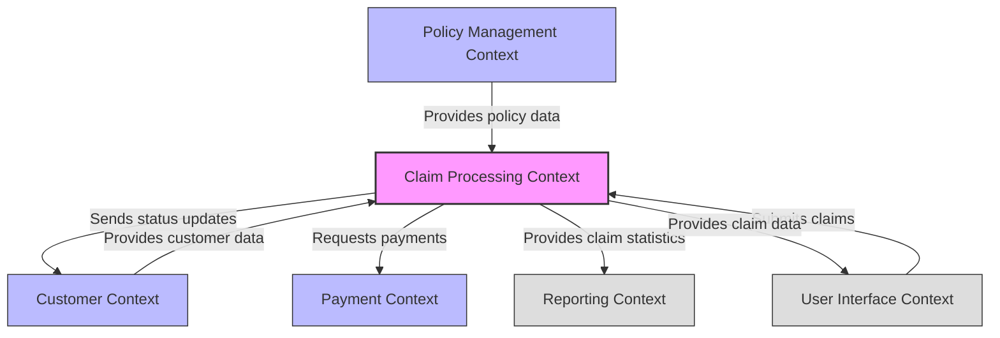

# Bounded Context Canvas - Insurance Claim Processing

This document provides a strategic overview of the Insurance Claim Processing bounded context, following the Bounded Context Canvas format.

## 1. Purpose
> *The reason this context exists, its mission and goals*

**Mission:** To efficiently process insurance claims submitted by customers, ensuring fair assessment, timely payments for valid claims, and clear communication throughout the process.

**Goals:**
- Streamline the insurance claim submission and assessment process
- Ensure accurate and consistent claim evaluation
- Minimize processing time from submission to payment/rejection
- Provide transparent status updates to customers
- Maintain compliance with insurance regulations and policies

## 2. Strategic Classification

| Aspect | Classification | Explanation |
|--------|---------------|-------------|
| **Domain Type** | Core | Claims processing is a core business capability for an insurance company |
| **Business Impact** | High | Directly affects customer satisfaction, financial outcomes, and reputation |
| **Competitive Advantage** | Differentiator | Efficient claims handling is a key differentiator in customer retention |
| **Technical Risk** | Medium | Complex business rules, integration points, but well-understood domain |
| **Evolution Stage** | Mature | Insurance claims have established patterns but continue to evolve |

## 3. Domain Roles

| Role | Responsibilities |
|------|------------------|
| **Customer** | Submits claims, provides supporting documentation, receives notifications |
| **Administrator in charge** | Checks documentation completeness, registers claims in the system |
| **Claims department personnel** | Verifies insurance coverage, performs assessment, accepts/rejects claims |
| **System** | Schedules and performs payments, sends notifications |

## 4. Ubiquitous Language

| Term | Definition |
|------|------------|
| **Claim** | A formal request by a policyholder for coverage or compensation for a covered loss or policy event |
| **Assessment** | The process of evaluating a claim's validity against the policy terms |
| **Documentation** | Supporting evidence required for claim processing (receipts, reports, etc.) |
| **Payment Schedule** | The planned date and amount for claim reimbursement |
| **Rejection** | The denial of a claim due to policy limitations, fraud concerns, or incomplete information |
| **Notification** | Communication to the customer about claim status changes |
| **Policy** | The insurance contract that defines coverage terms |

## 5. Business Decisions

| Decision Area | Rules & Policies |
|---------------|------------------|
| **Claim Eligibility** | - Claim must be for a covered event under policy - Policy must be active at time of incident - Claim must be submitted within policy timeframe |
| **Documentation Requirements** | - All claims require proof of incident - Claims over certain amounts require additional documentation |
| **Assessment Criteria** | - Claim amount must be justified by documentation - Incident must match policy coverage - No exclusions should apply |
| **Payment Authorization** | - Claims under $X can be auto-approved if all criteria met - Claims over $X require manual review - Multi-tier approval for high-value claims |
| **Rejection Handling** | - All rejections must include specific reason - Customers must be notified of appeal process |

## 6. Domain Events

| Event | Meaning | Consumers |
|-------|---------|-----------|
| **ClaimSubmitted** | A new claim has been received | Claim Processing, Customer Communication |
| **ClaimRegistered** | Documentation verified and claim entered into system | Claim Processing, Reporting |
| **AssessmentPerformed** | Claim has been evaluated against policy | Claim Processing, Risk Management |
| **PaymentScheduled** | Claim approved and payment planned | Payment Processing, Accounting |
| **PaymentPerformed** | Money has been transferred to customer | Accounting, Customer Communication |
| **ClaimRejected** | Claim has been denied | Customer Communication, Reporting |
| **CustomerNotified** | Information sent to customer about claim status | Customer Service, Reporting |

## 7. Commands

| Command | Description | Initiated By |
|---------|-------------|--------------|
| **SubmitClaim** | Create new claim in the system | Customer |
| **CheckDocumentation** | Verify all required documents are provided | Administrator |
| **CheckInsurance** | Verify policy coverage for the claim | Claims Personnel |
| **AcceptClaim** | Approve claim and schedule payment | Claims Personnel |
| **RejectClaim** | Deny claim with specific reason | Claims Personnel |
| **PerformPayment** | Execute the payment transaction | System |
| **NotifyCustomer** | Send status update to customer | System |

## 8. Input/Output

### Inbound:
- **Policy data** from Policy Management Context
- **Customer data** from Customer Context
- **Payment capabilities** from Payment Context

### Outbound:
- **Claim status updates** to Customer Context
- **Payment requests** to Payment Context
- **Claim statistics** to Reporting Context

## 9. Context Map

## 10. Technical Characteristics

### Deployment Pattern:
- Microservice with dedicated database

### Data Consistency:
- Eventual consistency for cross-context data
- Strong consistency within the bounded context

### Availability Requirements:
- High availability (99.9%+) required for claim submission
- Medium availability acceptable for administration functions

### Technologies:
- Event-sourced architecture to track claim lifecycle
- Message queue for cross-context communication
- CQRS pattern for optimized read/write operations

## 11. Open Questions

1. Should this context be implemented as part of the existing Policy Management Context or as a separate Bounded Context?
2. What is the optimal way to integrate with the Payment Context?
3. How should we handle long-running claim processes that span multiple days or weeks?
4. What metrics should we capture to measure the efficiency of the claims process?
5. How should we implement fraud detection within the claims assessment process?