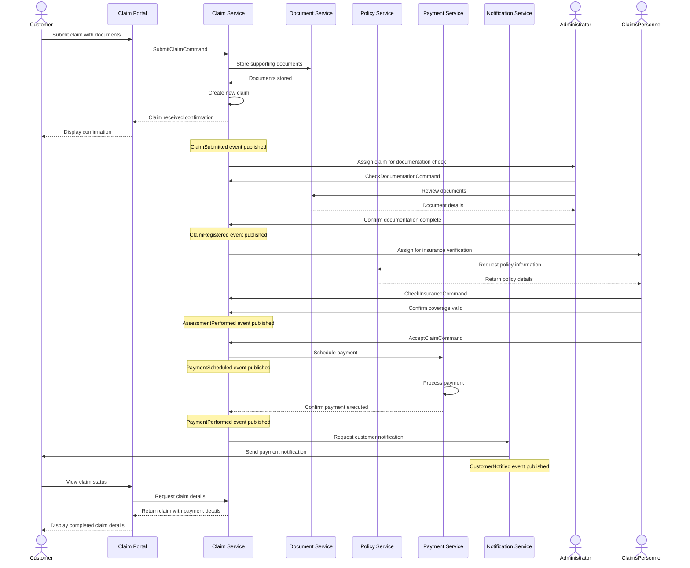
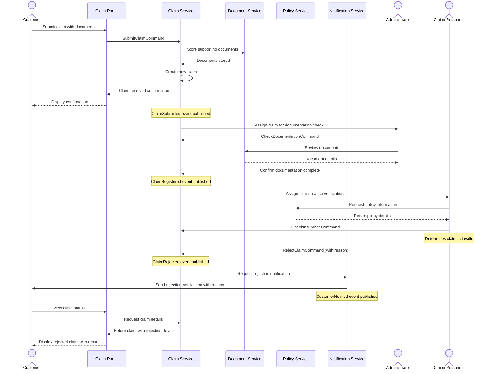
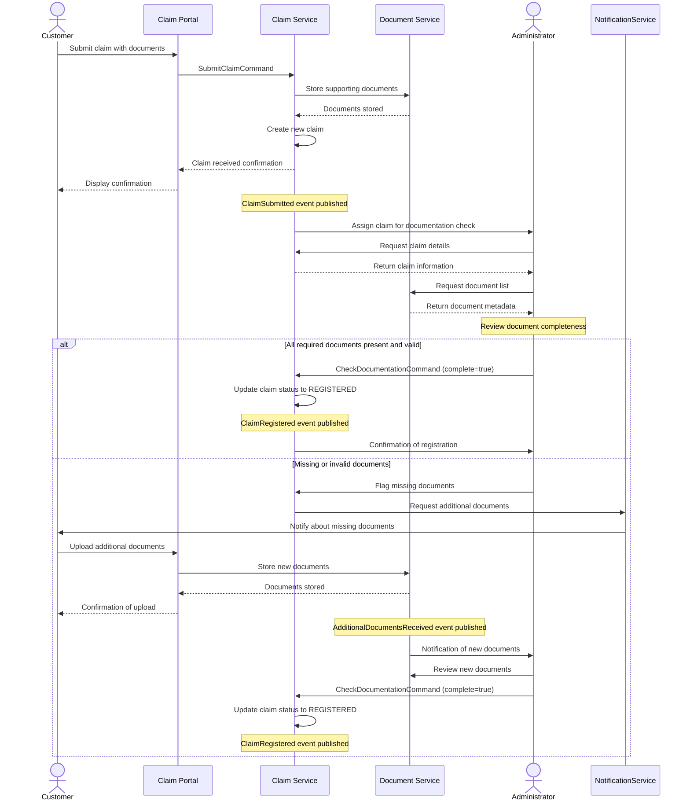
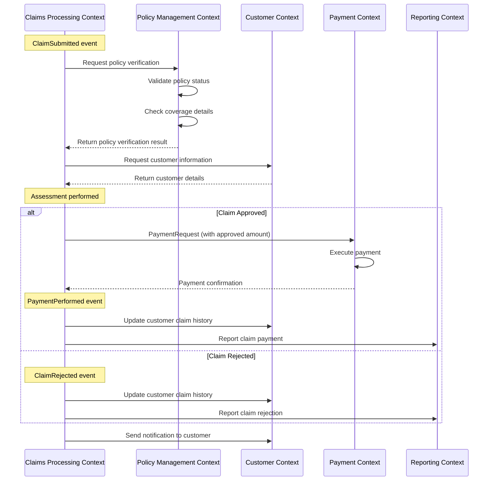
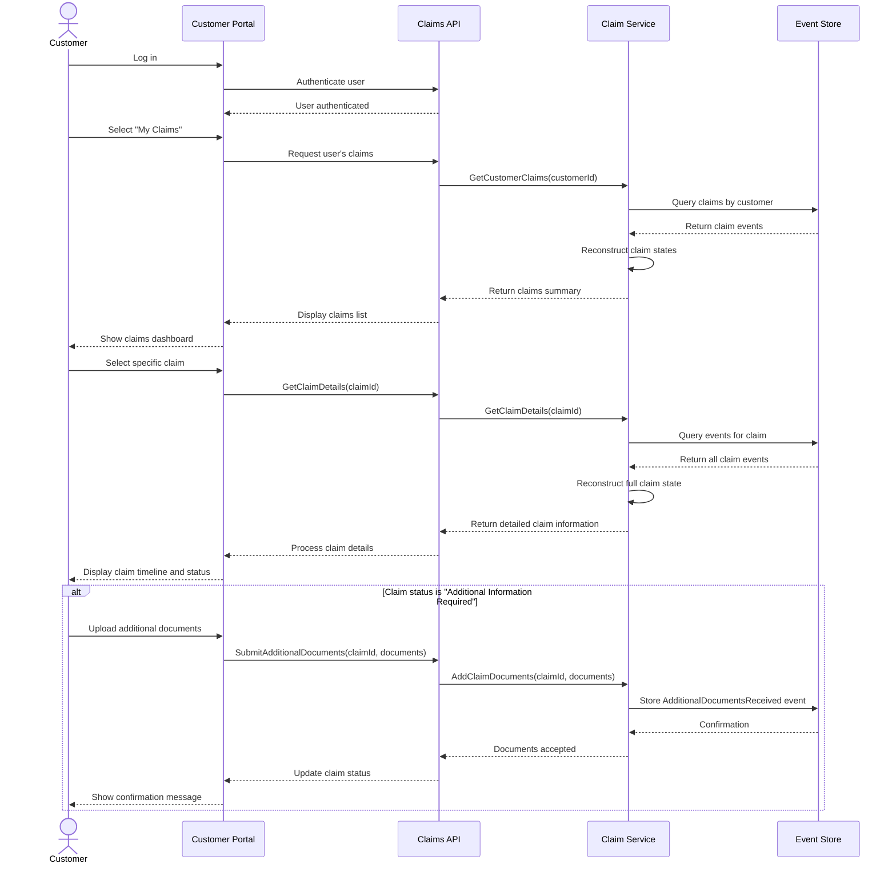

# Sequence Diagrams - Insurance Claim Workflows

This document provides detailed sequence diagrams for the main workflows in the Insurance Claim Processing context.

## 1. Successful Claim Processing Flow

This sequence diagram illustrates the complete flow of a successful claim from submission to payment and notification.

## 2. Claim Rejection Flow

This sequence diagram shows the flow when a claim is rejected during the assessment process.

## 3. Documentation Verification Flow

This sequence diagram focuses specifically on the documentation verification process, which is a critical step in claim processing.

## 4. Cross-Context Integration Flow

This sequence diagram illustrates how the Claims Processing context integrates with other bounded contexts to complete the claim lifecycle.

## 5. Claim Status Inquiry Flow

This sequence diagram shows how a customer can check on the status of their claim.

These sequence diagrams provide detailed views of the key workflows in the Insurance Claim Processing context, showing the interactions between users, services, and other contexts throughout the claim lifecycle.