# Implementation Architecture - Insurance Claim Processing System

This document outlines the implementation architecture for the Insurance Claim Processing system, based on the Domain-Driven Design (DDD) model and API specifications previously defined. The architecture uses Spring Boot for the backend services and React for the frontend applications.

## System Architecture Overview

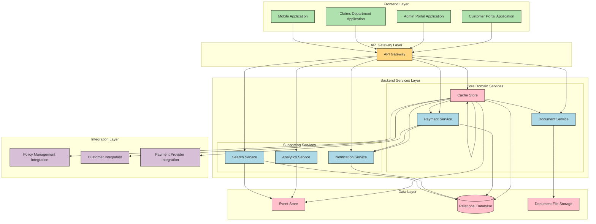

## Technology Stack

### Backend Technologies
- **Core Framework**: Spring Boot 3.2
- **API Development**: Spring WebFlux (reactive) for core services
- **Security**: Spring Security with OAuth 2.0/JWT
- **Database Access**: Spring Data JPA and R2DBC
- **Messaging**: Spring Cloud Stream with Kafka
- **Event Sourcing**: Axon Framework
- **Service Discovery**: Spring Cloud Netflix Eureka
- **API Gateway**: Spring Cloud Gateway
- **Documentation**: SpringDoc OpenAPI
- **Monitoring**: Spring Boot Admin, Micrometer, Prometheus
- **Testing**: JUnit 5, Mockito, Testcontainers

### Frontend Technologies
- **Core Framework**: React 18
- **State Management**: Redux Toolkit
- **UI Components**: Material-UI (MUI)
- **Form Handling**: React Hook Form
- **API Client**: Axios, React Query
- **Routing**: React Router
- **Internationalization**: i18next
- **Testing**: Jest, React Testing Library
- **Build Tool**: Vite

### Data Storage
- **Event Store**: MongoDB for event sourcing
- **Relational Database**: PostgreSQL for read models and operational data
- **Document Storage**: MinIO (S3-compatible) for claim documents
- **Cache**: Redis for distributed caching

### DevOps & Infrastructure
- **Containerization**: Docker
- **Orchestration**: Kubernetes
- **CI/CD**: GitHub Actions
- **Monitoring**: Grafana, Prometheus
- **Logging**: ELK Stack (Elasticsearch, Logstash, Kibana)
- **Infrastructure as Code**: Terraform
- **Secrets Management**: HashiCorp Vault

## System Components

### 1. Backend Services

#### Claim Service
The core domain service that implements the Claim aggregate and associated business logic.

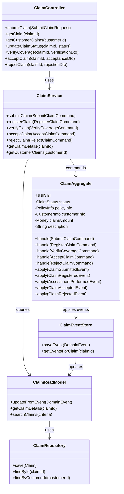

#### Payment Service
Handles all payment-related operations for claim settlements.

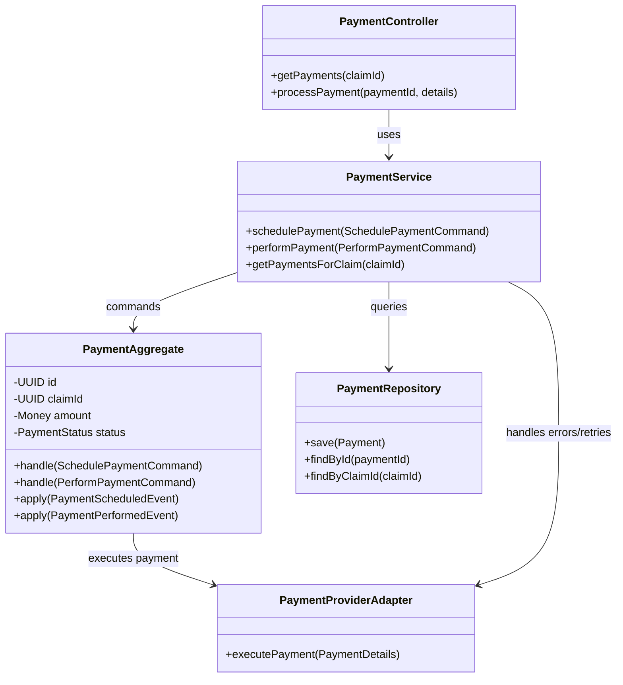

#### Document Service
Manages the document handling for insurance claims.

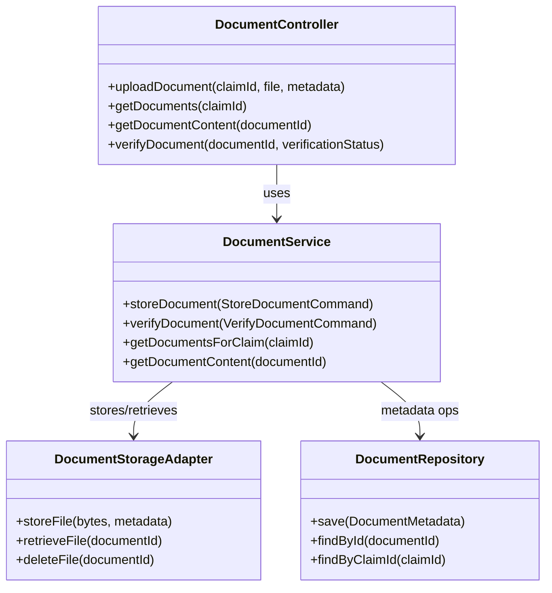

#### Notification Service
Handles sending notifications to customers about claim status changes.

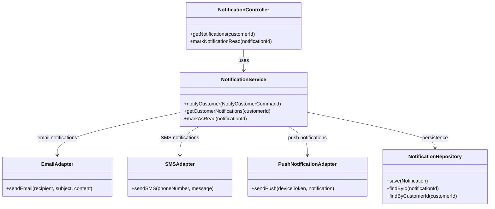

### 2. Integration Services

#### Policy Management Integration
Integrates with the Policy Management bounded context.

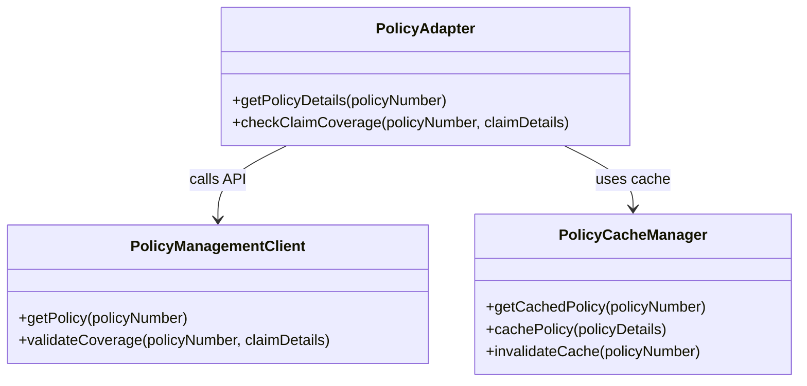

#### Customer Integration
Integrates with the Customer bounded context.

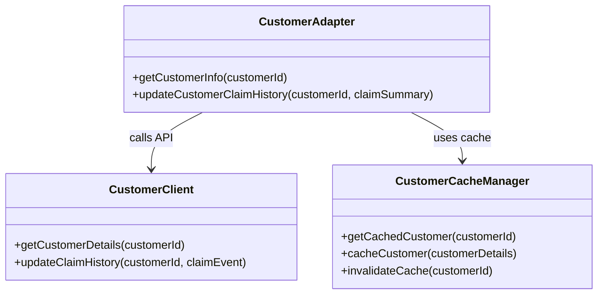

### 3. Frontend Applications

#### Customer Portal
The web application for customers to submit and track their claims.

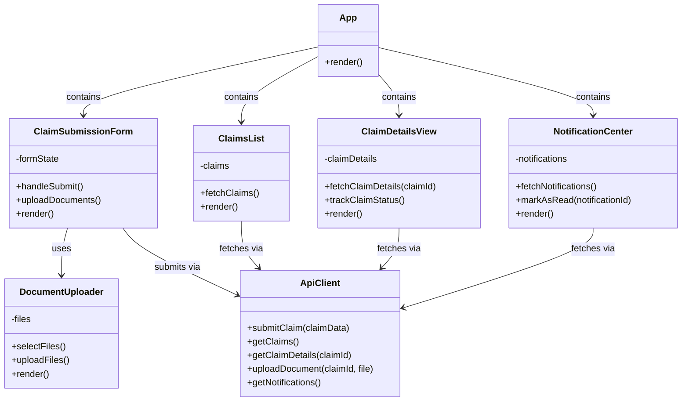

#### Claims Department Portal
The web application for claims personnel to process claims.

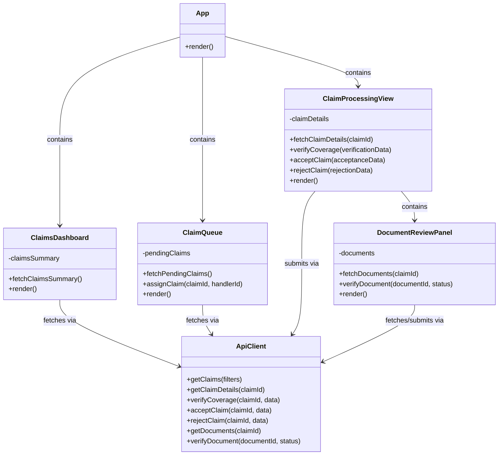

## Implementation Patterns

### 1. CQRS (Command Query Responsibility Segregation)

The system uses CQRS to separate command (write) operations from query (read) operations:

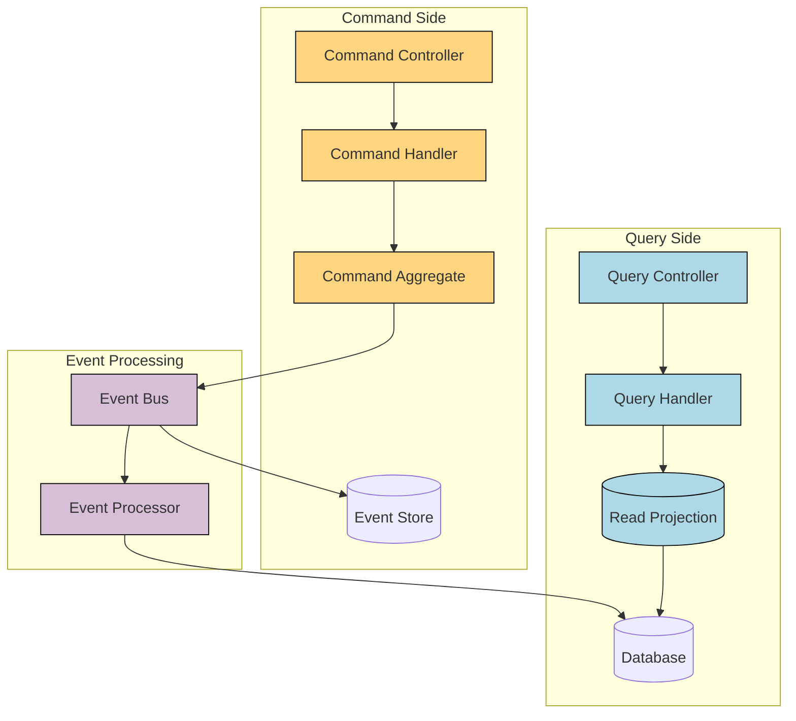

### 2. Event Sourcing

The system uses event sourcing to maintain a complete history of all domain events:

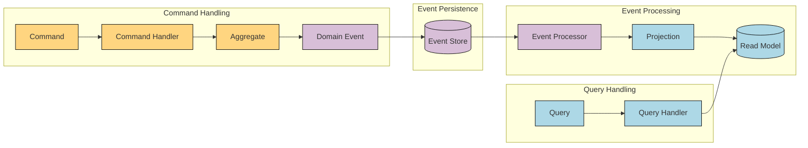

### 3. Microservices Architecture

The system is implemented as a set of microservices, each with its own bounded context:

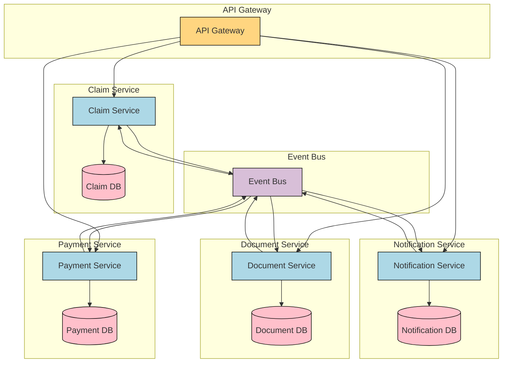

## Implementation Details

### 1. Backend Implementation with Spring Boot

#### Domain Layer

```java
@Aggregate
public class ClaimAggregate {
    @AggregateIdentifier
    private UUID id;
    private ClaimStatus status;
    private PolicyInfo policyInfo;
    private CustomerInfo customerInfo;
    private Money claimAmount;
    private List<DocumentReference> documents;
    
    @CommandHandler
    public ClaimAggregate(SubmitClaimCommand command) {
        apply(new ClaimSubmittedEvent(
            command.getClaimId(),
            command.getPolicyNumber(),
            command.getCustomerId(),
            command.getClaimAmount(),
            command.getDescription(),
            command.getIncidentDate()
        ));
    }
    
    @CommandHandler
    public void handle(RegisterClaimCommand command) {
        if (status != ClaimStatus.SUBMITTED) {
            throw new IllegalStateException("Claim must be in SUBMITTED state to be registered");
        }
        
        apply(new ClaimRegisteredEvent(
            id,
            command.getAdministratorId(),
            command.getRegistrationDate()
        ));
    }
    
    @CommandHandler
    public void handle(AcceptClaimCommand command) {
        if (status != ClaimStatus.REGISTERED && status != ClaimStatus.UNDER_ASSESSMENT) {
            throw new IllegalStateException("Claim must be in REGISTERED or UNDER_ASSESSMENT state to be accepted");
        }
        
        apply(new ClaimAcceptedEvent(
            id,
            command.getHandlerId(),
            command.getApprovedAmount(),
            command.getScheduledDate()
        ));
    }
    
    @EventSourcingHandler
    public void on(ClaimSubmittedEvent event) {
        this.id = event.getClaimId();
        this.status = ClaimStatus.SUBMITTED;
        this.policyInfo = new PolicyInfo(event.getPolicyNumber());
        this.customerInfo = new CustomerInfo(event.getCustomerId());
        this.claimAmount = event.getClaimAmount();
        this.documents = new ArrayList<>();
    }
    
    @EventSourcingHandler
    public void on(ClaimRegisteredEvent event) {
        this.status = ClaimStatus.REGISTERED;
    }
    
    @EventSourcingHandler
    public void on(ClaimAcceptedEvent event) {
        this.status = ClaimStatus.ACCEPTED;
    }
}
```

#### Application Layer

```java
@Service
public class ClaimApplicationService {
    private final CommandGateway commandGateway;
    private final QueryGateway queryGateway;
    private final ClaimRepository claimRepository;
    
    public ClaimApplicationService(CommandGateway commandGateway, QueryGateway queryGateway, 
                                  ClaimRepository claimRepository) {
        this.commandGateway = commandGateway;
        this.queryGateway = queryGateway;
        this.claimRepository = claimRepository;
    }
    
    public CompletableFuture<String> submitClaim(SubmitClaimRequest request) {
        UUID claimId = UUID.randomUUID();
        
        return commandGateway.send(new SubmitClaimCommand(
            claimId,
            request.getPolicyNumber(),
            request.getCustomerId(),
            request.getClaimAmount(),
            request.getDescription(),
            request.getIncidentDate()
        ));
    }
    
    public ClaimDetailsDTO getClaimDetails(UUID claimId) {
        return queryGateway.query(
            new GetClaimDetailsQuery(claimId), 
            ResponseTypes.instanceOf(ClaimDetailsDTO.class)
        ).join();
    }
}
```

#### API Layer

```java
@RestController
@RequestMapping("/claims")
public class ClaimController {
    private final ClaimApplicationService claimService;
    
    public ClaimController(ClaimApplicationService claimService) {
        this.claimService = claimService;
    }
    
    @PostMapping
    @ResponseStatus(HttpStatus.CREATED)
    public CompletableFuture<ClaimSubmissionResponse> submitClaim(@RequestBody SubmitClaimRequest request) {
        return claimService.submitClaim(request)
            .thenApply(claimId -> {
                ClaimSubmissionResponse response = new ClaimSubmissionResponse();
                response.setClaimId(claimId);
                response.setStatus(ClaimStatus.SUBMITTED.toString());
                response.setSubmissionDate(LocalDateTime.now());
                return response;
            });
    }
    
    @GetMapping("/{claimId}")
    public CompletableFuture<ClaimDetailsDTO> getClaimDetails(@PathVariable UUID claimId) {
        return CompletableFuture.completedFuture(claimService.getClaimDetails(claimId));
    }
}
```

### 2. Frontend Implementation with React

#### Component Organization

```tsx
// ClaimSubmissionForm.tsx
import React, { useState } from 'react';
import { useForm } from 'react-hook-form';
import { useDispatch } from 'react-redux';
import { submitClaim } from '../slices/claimsSlice';

interface ClaimFormData {
  policyNumber: string;
  claimType: string;
  incidentDate: string;
  description: string;
  damageAmount: number;
}

const ClaimSubmissionForm: React.FC = () => {
  const dispatch = useDispatch();
  const { register, handleSubmit, formState: { errors } } = useForm<ClaimFormData>();
  const [isSubmitting, setIsSubmitting] = useState(false);
  
  const onSubmit = async (data: ClaimFormData) => {
    setIsSubmitting(true);
    try {
      await dispatch(submitClaim(data));
      // Show success message
    } catch (error) {
      // Handle error
    } finally {
      setIsSubmitting(false);
    }
  };
  
  return (
    <form onSubmit={handleSubmit(onSubmit)}>
      <div className="form-group">
        <label htmlFor="policyNumber">Policy Number</label>
        <input 
          id="policyNumber"
          type="text" 
          {...register('policyNumber', { required: true })} 
        />
        {errors.policyNumber && <span className="error">This field is required</span>}
      </div>
      
      {/* More form fields */}
      
      <button type="submit" disabled={isSubmitting}>
        {isSubmitting ? 'Submitting...' : 'Submit Claim'}
      </button>
    </form>
  );
};

export default ClaimSubmissionForm;
```

#### API Integration

```tsx
// api/claimsApi.ts
import axios from 'axios';
import { createApi, fetchBaseQuery } from '@reduxjs/toolkit/query/react';

const API_BASE_URL = process.env.REACT_APP_API_URL || 'https://api.insurance-company.com/claims/v1';

export const claimsApi = createApi({
  reducerPath: 'claimsApi',
  baseQuery: fetchBaseQuery({ 
    baseUrl: API_BASE_URL,
    prepareHeaders: (headers) => {
      const token = localStorage.getItem('auth_token');
      if (token) {
        headers.set('authorization', `Bearer ${token}`);
      }
      return headers;
    },
  }),
  endpoints: (builder) => ({
    submitClaim: builder.mutation({
      query: (claim) => ({
        url: '/claims',
        method: 'POST',
        body: claim,
      }),
    }),
    getClaims: builder.query({
      query: () => '/customers/me/claims',
    }),
    getClaimById: builder.query({
      query: (claimId) => `/claims/${claimId}`,
    }),
    uploadDocument: builder.mutation({
      query: ({ claimId, formData }) => ({
        url: `/claims/${claimId}/documents`,
        method: 'POST',
        body: formData,
        formData: true,
      }),
    }),
  }),
});

export const { 
  useSubmitClaimMutation,
  useGetClaimsQuery,
  useGetClaimByIdQuery,
  useUploadDocumentMutation,
} = claimsApi;
```

### 3. Security Implementation

#### Backend Security with Spring Security

```java
@Configuration
@EnableWebSecurity
public class SecurityConfig {

    @Bean
    public SecurityFilterChain filterChain(HttpSecurity http) throws Exception {
        http
            .csrf().disable()
            .authorizeHttpRequests(authorize -> authorize
                .requestMatchers("/actuator/health").permitAll()
                .requestMatchers("/claims").hasAnyRole("CUSTOMER", "ADMIN")
                .requestMatchers("/claims/{claimId}").hasAnyRole("CUSTOMER", "ADMIN", "CLAIMS_HANDLER")
                .requestMatchers("/claims/{claimId}/accept").hasRole("CLAIMS_HANDLER")
                .requestMatchers("/claims/{claimId}/reject").hasRole("CLAIMS_HANDLER")
                .requestMatchers("/admin/**").hasRole("ADMIN")
                .anyRequest().authenticated()
            )
            .oauth2ResourceServer(oauth2 -> oauth2.jwt(jwt -> jwt.jwtAuthenticationConverter(jwtAuthenticationConverter())))
            .sessionManagement(session -> session.sessionCreationPolicy(SessionCreationPolicy.STATELESS));
        
        return http.build();
    }
    
    private Converter<Jwt, ? extends AbstractAuthenticationToken> jwtAuthenticationConverter() {
        JwtGrantedAuthoritiesConverter jwtGrantedAuthoritiesConverter = new JwtGrantedAuthoritiesConverter();
        jwtGrantedAuthoritiesConverter.setAuthoritiesClaimName("roles");
        jwtGrantedAuthoritiesConverter.setAuthorityPrefix("ROLE_");
        
        JwtAuthenticationConverter jwtAuthenticationConverter = new JwtAuthenticationConverter();
        jwtAuthenticationConverter.setJwtGrantedAuthoritiesConverter(jwtGrantedAuthoritiesConverter);
        
        return jwtAuthenticationConverter;
    }
}
```

## Deployment Architecture

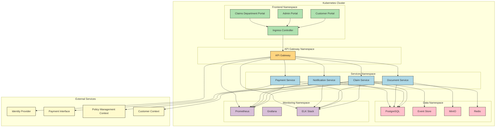

## Development Process and CI/CD

```mermaid
graph LR
    subgraph "Development"
        DEV[Developer Workstation]
        GHR[GitHub Repository]
    end
    
    subgraph "CI/CD Pipeline"
        GHA[GitHub Actions]
        TESTS[Automated Tests]
        BUILD[Build Applications]
        SCAN[Security Scan]
        PUSH[Push Container Images]
    end
    
    subgraph "Environments"
        DEV_ENV[Development]
        TEST_ENV[Testing]
        STAGE_ENV[Staging]
        PROD_ENV[Production]
    end
    
    DEV --> GHR
    GHR --> GHA
    
    GHA --> TESTS
    TESTS --> BUILD
    BUILD --> SCAN
    SCAN --> PUSH
    
    PUSH --> DEV_ENV
    DEV_ENV -- Manual Approval --> TEST_ENV
    TEST_ENV -- Manual Approval --> STAGE_ENV
    STAGE_ENV -- Manual Approval --> PROD_ENV
    
    classDef dev fill:#AFE1AF,stroke:#000,stroke-width:1px
    classDef ci fill:#ADD8E6,stroke:#000,stroke-width:1px
    classDef env fill:#FFD580,stroke:#000,stroke-width:1px
    
    class DEV,GHR dev
    class GHA,TESTS,BUILD,SCAN,PUSH ci
    class DEV_ENV,TEST_ENV,STAGE_ENV,PROD_ENV env
```

## Conclusion

This implementation architecture provides a comprehensive approach to building the Insurance Claim Processing system using modern technologies and best practices. By leveraging Spring Boot for the backend services and React for the frontend applications, we can create a scalable, maintainable, and robust system that aligns with the Domain-Driven Design principles identified in our event storming sessions.

The architecture supports:

- Clean separation of bounded contexts
- Implementation of domain events and commands
- Scalable microservices architecture
- Modern UI with responsive design
- Secure authentication and authorization
- Comprehensive monitoring and logging
- Automated testing and continuous deployment

Next steps would include:

1. Creating detailed technical specifications for each service
2. Setting up the development environment
3. Implementing core domain services first (Claim Service)
4. Building integration services and supporting infrastructure
5. Developing the frontend applications
6. Setting up the CI/CD pipeline and deployment infrastructure