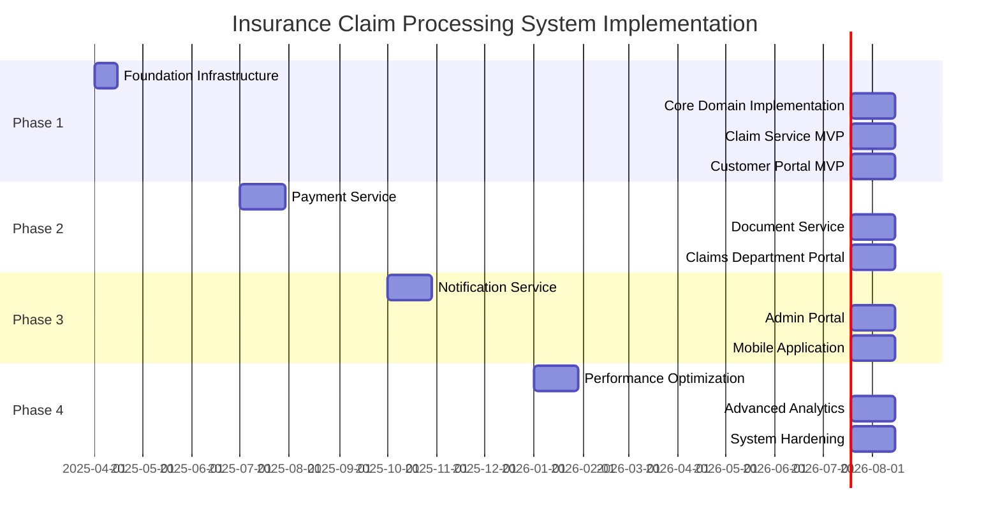
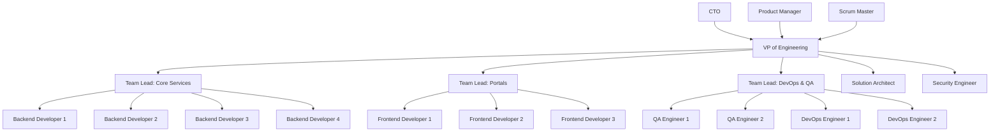

# Project Roadmap - Insurance Claim Processing System

This roadmap outlines the phased implementation plan for the Insurance Claim Processing System, providing engineers with a clear understanding of priorities, dependencies, and delivery timelines.

## Phase 1: Foundation (Q2 2025)

### Milestone 1.1: Core Domain Implementation (Weeks 1-4)
- Set up development infrastructure and CI/CD pipelines
- Implement Claim aggregate with core domain logic
- Implement basic claim submission flow
- Create initial database schemas and event store

### Milestone 1.2: Claim Service MVP (Weeks 5-8)
- Implement claim registration and documentation verification
- Build claim assessment workflows
- Create read models for claim queries
- Implement claim status tracking

### Milestone 1.3: Customer Portal MVP (Weeks 9-12)
- Develop authentication and authorization
- Build claim submission interface
- Create claim status tracking interface
- Implement document upload capabilities

**Key Deliverables:**
- Functioning Claim Service with REST API
- Customer Portal with basic claim submission
- CI/CD pipeline for automated testing and deployment
- Containerized development environment

## Phase 2: Core Functionality (Q3 2025)

### Milestone 2.1: Payment Service Implementation (Weeks 13-16)
- Implement Payment aggregate
- Build payment scheduling and processing workflows
- Create integration with external payment providers
- Implement payment tracking and reconciliation

### Milestone 2.2: Document Service Implementation (Weeks 17-20)
- Build document storage and retrieval system
- Implement document verification workflows
- Create document metadata management
- Build integration with MinIO for document storage

### Milestone 2.3: Claims Department Portal (Weeks 21-24)
- Develop claim assessment interface
- Build document verification interface
- Create claim approval/rejection workflows
- Implement payment management interface

**Key Deliverables:**
- Complete payment processing capabilities
- Document management system
- Claims Department Portal for internal users
- Integration with external payment systems

## Phase 3: Integration and Enhancement (Q4 2025)

### Milestone 3.1: Notification Service (Weeks 25-28)
- Implement notification templates
- Build email notification service
- Create SMS notification capabilities
- Implement in-app notifications

### Milestone 3.2: Admin Portal (Weeks 29-32)
- Develop system configuration interface
- Build user management and access control
- Create reporting and analytics dashboards
- Implement audit logging interface

### Milestone 3.3: Mobile Application (Weeks 33-36)
- Develop progressive web app
- Build offline-first capabilities
- Implement push notifications
- Create mobile-optimized interfaces

**Key Deliverables:**
- Comprehensive notification system
- Admin portal for system management
- Mobile-optimized experience
- Complete system integration

## Phase 4: Optimization and Scaling (Q1 2026)

### Milestone 4.1: Performance Optimization (Weeks 37-40)
- Conduct load and stress testing
- Implement caching strategy
- Optimize database queries
- Fine-tune API responses

### Milestone 4.2: Advanced Analytics (Weeks 41-44)
- Implement claims analytics dashboard
- Build fraud detection capabilities
- Create predictive models for claims assessment
- Develop business intelligence reporting

### Milestone 4.3: System Hardening (Weeks 45-48)
- Conduct security audits and penetration testing
- Implement additional security controls
- Optimize infrastructure for cost efficiency
- Enhance disaster recovery capabilities

**Key Deliverables:**
- Optimized system performance
- Advanced analytics and reporting
- Enhanced security posture
- Production-ready system

## Dependencies and Critical Path

## Risk Assessment and Mitigation

| Risk | Impact | Probability | Mitigation Strategy |
|------|--------|-------------|---------------------|
| Integration challenges with Policy Management | High | Medium | Early proof-of-concept, develop Anti-Corruption Layer |
| Performance issues with event sourcing | High | Medium | Performance testing early, optimize read models |
| Security vulnerabilities | Critical | Low | Regular security audits, SAST/DAST in CI/CD |
| Team skill gaps in DDD/CQRS | Medium | Medium | Training sessions, pair programming, architecture reviews |
| Scope creep | High | High | Regular backlog refinement, strong product ownership |
| Third-party payment provider issues | High | Medium | Adapter pattern, fallback mechanisms, circuit breakers |

## Success Metrics

- **Performance**: 
  - 99.9% system availability
  - API response time < 200ms (p95)
  - Claim submission processing time < 2s

- **Quality**:
  - < 1 critical bug per month in production
  - 100% of critical flows covered by automated tests
  - < 2% of claims requiring manual intervention

- **Business**:
  - 95% of claims processed within SLA
  - 20% reduction in claim processing time
  - 15% reduction in operational costs
  - 90% customer satisfaction rating

## Engineering Team Structure

## Technical Debt Strategy

We acknowledge that some technical debt is inevitable. Our approach is to:

1. **Identify and track**: All technical debt must be documented in JIRA with the "tech-debt" label
2. **Assess impact**: Categorize as "critical", "major", or "minor" based on impact
3. **Allocate time**: Dedicate 20% of each sprint to addressing technical debt
4. **Prioritize**: Address critical debt immediately, schedule others based on impact
5. **Prevent**: Regular architecture reviews to prevent unnecessary debt

## Conclusion

This roadmap provides a strategic guide for the development of the Insurance Claim Processing System. It will be reviewed and updated quarterly to reflect progress, changing requirements, and new insights.

The VP of Engineering and Solution Architect will oversee the implementation of this roadmap, with regular updates to stakeholders. Team leads are responsible for tracking progress against their respective milestones and raising potential risks or blockers early.